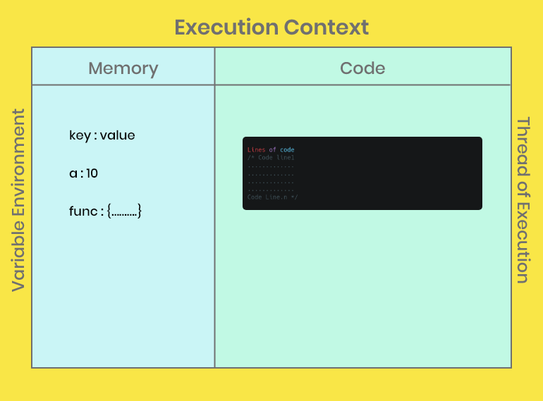

#### Ever wondered how JavaScript works under the hood?

Well let me help you understand that along with explaining about the `Execution Context`.

Before knowing in depth about `Execution Context` remember one thing.

> "Everything in JavaScript happens inside an Execution Context"



`Execution Context` consists of two parts
* The Memory block also known as Variable Environment
* The Code block also known as Thread of Execution.

The memory block stores all the variables and functions as key:value pairs and allocates memory to them.
The code block executes the code line by line.

The `Execution Context` is created in two phases

1. Memory Creation phase
1. Code Execution phase

Consider the following piece of code to be executed

```javascript
var n = 2;
function square(num) {
    var ans = num * num;
    return ans;
}

var square2 = square(n);
var square4 = square(4);
```

The allocation of memory during Memory Creation phase will be: 


While in the memory creation phase, the code is read top to down and memory is allocated to variables and functions present in the code.
They are stored as key : value pairs. Variable name is stored with special value of `undefined`. Where as the functions are stored with the whole code as it is as a value.

Will write about Code execution phase shortly.... till then stay tuned.